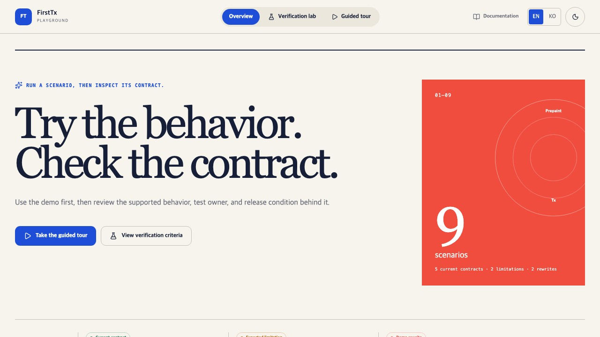
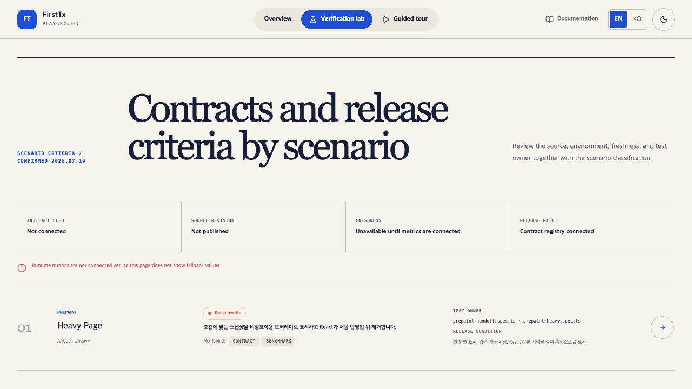
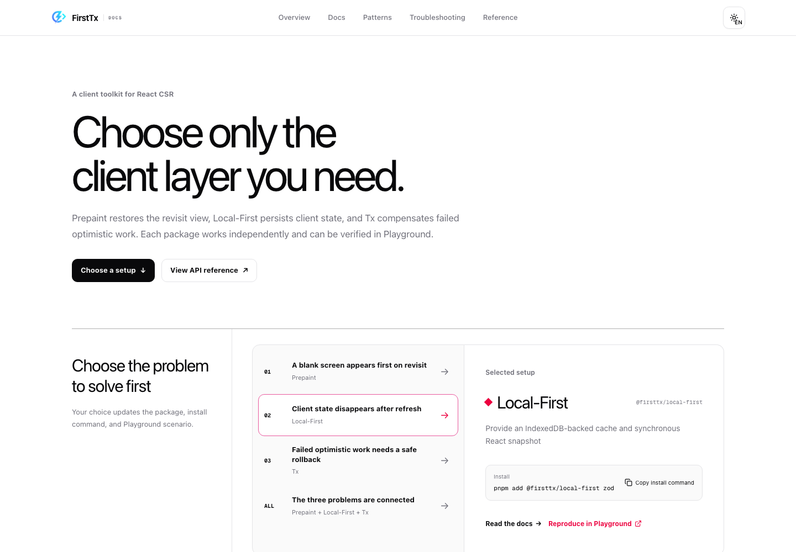
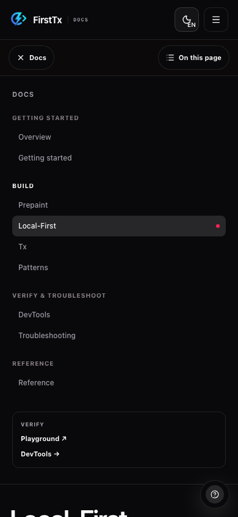

<p align="center">
  
</p>

# FirstTx

[](https://scorecard.dev/viewer/?uri=github.com/joseph0926/firsttx)
[](https://opensource.org/licenses/MIT)

[Docs](https://firsttx.store/en) | [Playground](https://firsttx-playground.vercel.app) | [DevTools](https://chromewebstore.google.com/detail/firsttx-devtools/onpdifkipmmkajdhodmpphmlpbnopkdd)

> 한국어 버전은 [docs/README.ko.md](./docs/README.ko.md)를 확인해주세요.

**Reduce blank time on CSR revisits by replaying the last visual state**

## TL;DR

FirstTx combines three client-side layers for CSR revisits:

- **Prepaint**: Replay a sanitized visual snapshot before the app bundle starts
- **Local-First**: Persist React model snapshots in IndexedDB and revalidate them from the server
- **Tx**: Run optimistic steps with retry and reverse-order compensating rollback

## Demo

<table>
<tr>
<td align="center">Scenario overview</td>
<td align="center">Verification criteria</td>
</tr>
<tr>
<td></td>
<td></td>
</tr>
</table>

The Playground contains nine scenarios across Prepaint, Local-First, and Tx. Each scenario identifies one of three states: behavior that matches the current contract, a known limitation, or a demo that still needs revision. Runtime metrics are shown only when a measurement artifact is connected.

> Run the scenarios in [Playground](https://firsttx-playground.vercel.app) or review the [Playground guide](./apps/playground/README.md).

## Documentation

<table>
<tr>
<td align="center">Choose a setup</td>
<td align="center">Navigate by task</td>
</tr>
<tr>
<td></td>
<td></td>
</tr>
</table>

The documentation is organized around adoption tasks: start with product fit, choose a setup, build each layer, verify behavior, troubleshoot failures, and look up exact public contracts.

[Overview](https://firsttx.store/en/docs/overview) · [Getting Started](https://firsttx.store/en/docs/getting-started) · [Patterns](https://firsttx.store/en/docs/patterns) · [Troubleshooting](https://firsttx.store/en/docs/troubleshooting) · [Reference](https://firsttx.store/en/docs/reference)

## Why FirstTx?

FirstTx adds reusable visual snapshot, persistent client cache, and compensation primitives while keeping a CSR architecture.

## Installation

```bash
pnpm add @firsttx/prepaint @firsttx/local-first @firsttx/tx
```

<details>
<summary>Partial installation</summary>

- Revisit only: `pnpm add @firsttx/prepaint`
- Revisit + Sync: `pnpm add @firsttx/prepaint @firsttx/local-first`
- Sync + Tx: `pnpm add @firsttx/local-first @firsttx/tx`

> Tx requires Local-First as a dependency.

</details>

> ESM-only. For CommonJS, use dynamic `import()`.

## Quick Start

### 1. Vite Plugin

```ts
// vite.config.ts
import { firstTx } from '@firsttx/prepaint/plugin/vite';

export default defineConfig({
  plugins: [
    firstTx({
      policy: { routes: ['/dashboard', '/cart'] },
    }),
  ],
});
```

> Prepaint is off until `policy.routes` explicitly opts paths in. Snapshot restore always uses a non-interactive overlay outside the React root.

### 2. Entry Point

```tsx
// main.tsx
import { createFirstTxRoot } from '@firsttx/prepaint';

createFirstTxRoot(document.getElementById('root')!, <App />);
```

### 3. Use in Component

```tsx
import { useSyncedModel } from '@firsttx/local-first';

function CartPage() {
  const { data: cart } = useSyncedModel(CartModel, () => fetch('/api/cart').then((r) => r.json()));
  if (!cart) return <Skeleton />;
  return <CartList items={cart.items} />;
}
```

> For optimistic updates with Tx, see the [Tx API reference](https://firsttx.store/en/docs/reference#tx).

## When to Use

| Use FirstTx                      | Consider Alternatives                      |
| -------------------------------- | ------------------------------------------ |
| Internal tools (CRM, dashboards) | Public landing pages → SSR/SSG             |
| Frequent revisits (10+/day)      | First-visit performance critical → SSR     |
| No SEO requirements              | Always need latest data → Server-driven UI |

## Browser Support

| Browser     | Min Version | ViewTransition    |
| ----------- | ----------- | ----------------- |
| Chrome/Edge | 111+        | Full              |
| Firefox     | Latest      | Graceful fallback |
| Safari      | 16+         | Graceful fallback |

## Troubleshooting

**UI duplicates on refresh**: Upgrade to `@firsttx/prepaint@0.11.0` or later and mount React through `createFirstTxRoot`. No overlay option is required.

**Frequently changing snapshot content**: Add `data-firsttx-volatile` to content that should be cleared from the captured visual snapshot.

**TypeScript errors**: Add `declare const __FIRSTTX_DEV__: boolean`.

More at [GitHub Issues](https://github.com/joseph0926/firsttx/issues).

## Links

- [API Reference](https://firsttx.store/en/docs/reference)
- [Playground](https://firsttx-playground.vercel.app)
- [DevTools](https://chromewebstore.google.com/detail/firsttx-devtools/onpdifkipmmkajdhodmpphmlpbnopkdd)
- [GitHub](https://github.com/joseph0926/firsttx)
- [Issues](https://github.com/joseph0926/firsttx/issues)

## License

MIT © [joseph0926](https://github.com/joseph0926)
