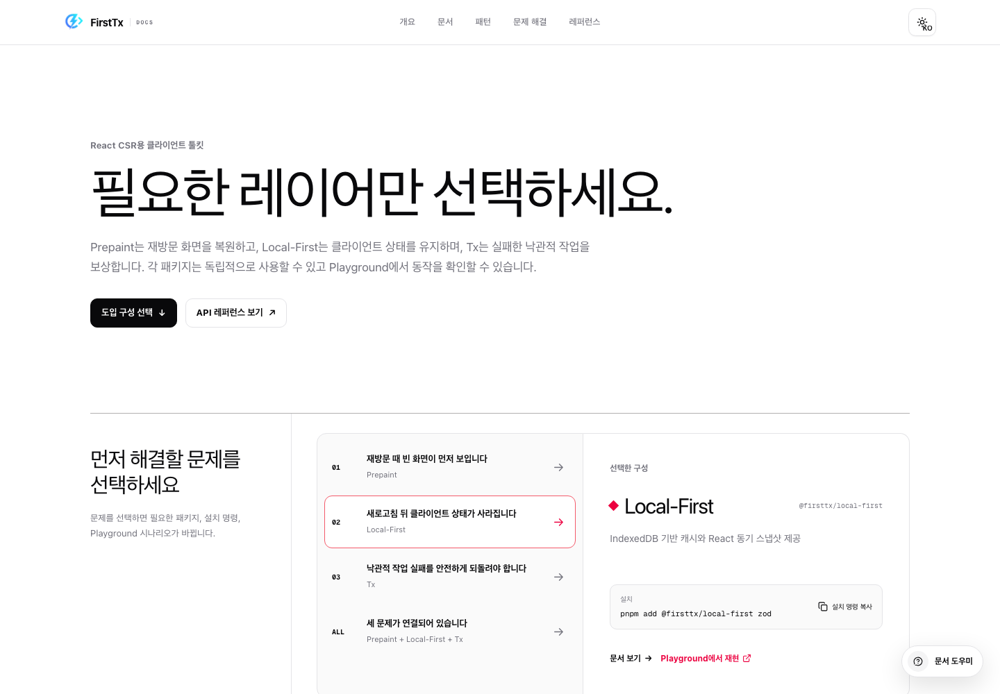

# FirstTx Docs (`apps/docs`)

FirstTx의 제품 적합성 판단, 도입 구성 선택, 구현, 검증, 문제 해결과 공개 API 조회를 담당하는 Next.js 문서 앱입니다. 한국어와 영어 화면, canonical MDX 기반 RAG 입력, 선택적으로 노출되는 문서 Chat을 함께 소유합니다.

## 화면

<table>
<tr>
<td align="center">도입 구성 선택</td>
<td align="center">모바일 Docs navigation</td>
</tr>
<tr>
<td></td>
<td></td>
</tr>
</table>

## 실행

저장소 루트에서 실행합니다. Node.js 24와 pnpm 11이 필요합니다.

```bash
pnpm install
pnpm --filter @firsttx/docs dev
```

개발 서버의 기본 주소는 `http://localhost:3000`입니다. 실제 locale route는 `/ko` 또는 `/en`에서 시작합니다.

## Route

- Landing: `/{locale}`
- Start: `/{locale}/docs/overview`, `/{locale}/docs/getting-started`
- Build: `/{locale}/docs/prepaint`, `/{locale}/docs/local-first`, `/{locale}/docs/tx`, `/{locale}/docs/patterns`
- Verify & Troubleshoot: `/{locale}/docs/devtools`, `/{locale}/docs/troubleshooting`
- Reference: `/{locale}/docs/reference`

지원 locale은 `ko`, `en`입니다. 문서 route는 locale별 canonical, alternate language와 sitemap entry를 제공합니다.

## 콘텐츠와 RAG

`content/docs/*.{ko,en}.mdx`가 화면 문서와 RAG 입력이 공유하는 유일한 canonical content source입니다.

```text
content/docs/*.mdx
  -> scripts/canonical-mdx.ts
  -> scripts/chunk-md.ts
  -> embedding
  -> locale별 vector namespace
```

`pnpm --filter @firsttx/docs test:run`은 외부 서비스에 연결하지 않고 MDX normalization, KO/EN pairing, searchable chunk와 공개 계약 coverage를 검증합니다.

`pnpm --filter @firsttx/docs ai`는 embedding cache를 지우고 `ko`, `en` vector namespace를 reset한 뒤 새 chunk를 upsert하는 외부 상태 변경 명령입니다. 명시적인 운영 승인과 필요한 운영 설정을 갖춘 경우에만 실행합니다.

## Chat

Chat은 `NEXT_PUBLIC_ENABLE_CHAT=true`일 때만 노출됩니다. 답변 생성은 `/api/chat` route와 locale별 RAG 검색을 사용하지만, 문서를 읽고 탐색하는 데 필수 경로가 아닙니다.

localhost에서는 `chat-fixture=empty|streaming|unknown|error|rate-limit` query로 presentation state를 재현할 수 있습니다. fixture는 UI 검증용이며 외부 Chat 요청을 보내지 않습니다.

## 검증

```bash
pnpm --filter @firsttx/docs typecheck
pnpm --filter @firsttx/docs lint
pnpm --filter @firsttx/docs test:run
pnpm --filter @firsttx/docs build
```

## 주요 경로

- `app/[locale]/`: locale landing, Docs route와 metadata
- `components/landing/`: production landing과 setup selection
- `components/layout/`: global shell, grouped Docs navigation과 TOC
- `components/chat/`: non-blocking Chat presentation과 fixture state
- `components/mdx/`: code, install, callout, API table과 locale-aware link
- `content/docs/`: canonical KO/EN MDX
- `lib/docs/metadata.ts`: Docs canonical, hreflang와 share metadata
- `scripts/canonical-mdx.ts`: canonical MDX normalization
- `scripts/main.ts`: 외부 vector indexing entrypoint

## 관련 문서

- [Docs redesign decision packet](../../docs/uiux/docs-redesign.md)
- [Canonical content ledger](../../docs/uiux/docs-redesign-content-ledger.md)
- [전체 업데이트 계획](../../docs/update-plan.md)
