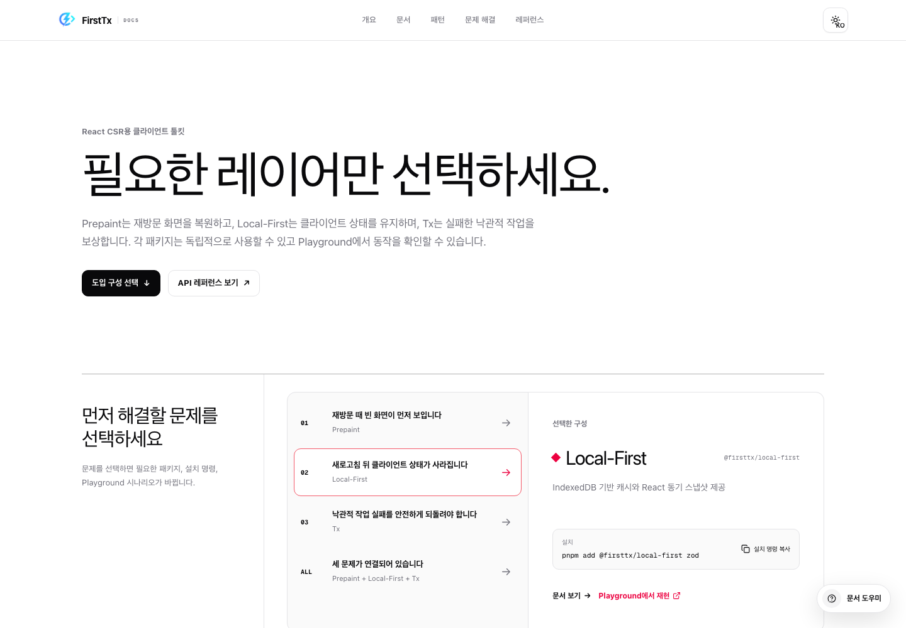
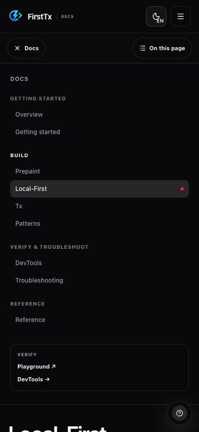

# FirstTx Docs (`apps/docs`)

FirstTx의 제품 적합성 판단, 도입 구성 선택, 구현, 검증, 문제 해결과 공개 API 조회를 담당하는 Next.js 문서 앱입니다. 한국어와 영어 화면, canonical MDX 기반 RAG 입력, 선택적으로 노출되는 문서 Chat을 함께 소유합니다.

## 화면

<table>
<tr>
<td align="center">도입 구성 선택</td>
<td align="center">모바일 Docs navigation</td>
</tr>
<tr>
<td></td>
<td></td>
</tr>
</table>

## 실행

저장소 루트에서 실행합니다. Node.js 24와 pnpm 11이 필요합니다.

```bash
pnpm install
pnpm --filter @firsttx/docs dev
```

개발 서버의 기본 주소는 `http://localhost:3000`입니다. 실제 locale route는 `/ko` 또는 `/en`에서 시작합니다.

## 콘텐츠와 RAG

`content/docs/*.{ko,en}.mdx`가 화면 문서와 RAG 입력이 공유하는 유일한 canonical content source입니다.

```text
content/docs/*.mdx
  -> scripts/canonical-mdx.ts
  -> scripts/chunk-md.ts
  -> embedding
  -> lib/vector/index-artifact.json (커밋됨)
  -> lib/vector/search.ts (brute-force cosine)
```

인덱스는 외부 vector 서비스가 아니라 **저장소에 커밋된 artifact**입니다. 코드와 함께 배포되므로 문서와 인덱스가 어긋난 채로 배포될 수 없고, 배포 실패 시 이전 배포가 그대로 유지됩니다. 187 chunk 기준 1.67 MB이며 검색은 0.38ms입니다.

`pnpm --filter @firsttx/docs test:run`은 외부 서비스에 연결하지 않고 MDX normalization, KO/EN pairing, searchable chunk와 공개 계약 coverage를 검증합니다.

모든 canonical MDX H2/H3는 바로 앞의 `DocsAnchor`가 server-rendered stable ID를 소유합니다. TOC는 `data-doc-heading`으로 명시된 content heading만 읽으며, anchor test는 heading의 누락·중복, KO/EN parity와 locale-only allowlist를 검증합니다.

`pnpm --filter @firsttx/docs ai:plan`은 canonical MDX만 읽어 locale별 content revision, source 수와 expected chunk 수를 JSON으로 출력하는 read-only 명령입니다. credential, `.env*`, Redis와 embedding provider를 읽거나 호출하지 않으므로 운영 승인 없이 실행할 수 있습니다. 성공 시 stdout은 JSON만 담고, 해당 locale의 canonical 문서가 없으면 stderr에 원인을 남기고 non-zero exit로 종료합니다.

`pnpm --filter @firsttx/docs ai:evaluate`는 `evaluations/cases.ts`의 고정 질문을 현재 index에 실행해 Hit@3와 MRR을 측정합니다. 커밋된 artifact를 그대로 사용하고 질의 embedding만 외부에 요청합니다. 결과는 `evaluations/results/`에 timestamp 파일로 남고 git에서 제외됩니다. `OPENAI_API_KEY`가 필요합니다.

`pnpm --filter @firsttx/docs ai:probe-unknown`은 문서에 답이 없는 질문 8건을 실제 retrieval context와 함께 모델에 보내 UNKNOWN 규칙이 지켜지는지 확인합니다. 생성 호출이 발생하므로 `ai:evaluate`와 분리된 opt-in 명령입니다. 위반은 간헐적이므로 한 번 통과했다고 안전하다고 판정하지 않습니다.

`pnpm --filter @firsttx/docs ai:build-index`는 canonical MDX를 다시 chunk하고 전체를 임베딩해 `lib/vector/index-artifact.json`을 재생성합니다. `OPENAI_API_KEY`가 필요하며 **생성된 파일을 커밋해야 배포에 반영됩니다.** 외부 저장소 상태를 바꾸지 않으므로 되돌리기는 파일을 되돌리는 것으로 끝납니다.

`pnpm --filter @firsttx/docs ai:check-index`는 artifact의 content revision이 현재 canonical 문서와 일치하는지 검사합니다. 외부 호출이 없어 credential 없이 실행되며 CI가 매 PR에서 돌립니다. 문서만 고치고 artifact 재생성을 잊으면 여기서 막힙니다.

문서를 고쳤다면 `ai:build-index`를 실행하고 artifact를 함께 커밋하세요.

## Chat

Chat은 `NEXT_PUBLIC_ENABLE_CHAT=true`일 때만 노출됩니다. 답변 생성은 `/api/chat` route와 locale별 RAG 검색을 사용하지만, 문서를 읽고 탐색하는 데 필수 경로가 아닙니다.

Chat을 켜려면 다음이 모두 필요합니다. retrieval은 커밋된 artifact를 쓰므로 vector 서비스는 필요하지 않습니다.

| 항목                                   | 용도                       | 없으면                         |
| -------------------------------------- | -------------------------- | ------------------------------ |
| `OPENAI_API_KEY`                       | 질의 embedding과 답변 생성 | 생성 실패                      |
| `UPSTASH_REDIS_REST_URL` / `..._TOKEN` | rate limit                 | **Chat이 503으로 fail-closed** |
| `NEXT_PUBLIC_ENABLE_CHAT=true`         | 위젯 노출                  | 위젯이 숨겨짐                  |

rate limit을 쓸 수 없으면 route는 요청을 통과시키지 않고 typed 503을 돌려줍니다. 한도 없이 생성 비용이 나가는 것보다 Chat을 잠시 닫는 편이 안전하기 때문입니다.

오류 응답은 HTTP status, stable cause와 retry metadata를 typed error로 보존합니다. UI는 message 문자열을 파싱하지 않으며 rate limit과 일반 server/network failure를 구분합니다.

localhost에서는 `chat-fixture=empty|streaming|unknown|error|rate-limit` query로 presentation state를 재현할 수 있습니다. fixture는 UI 검증용이며 외부 Chat 요청을 보내지 않습니다.

## 검증

```bash
pnpm --filter @firsttx/docs typecheck
pnpm --filter @firsttx/docs lint
pnpm --filter @firsttx/docs test:run
pnpm --filter @firsttx/docs build
pnpm --filter @firsttx/docs test:e2e
```
