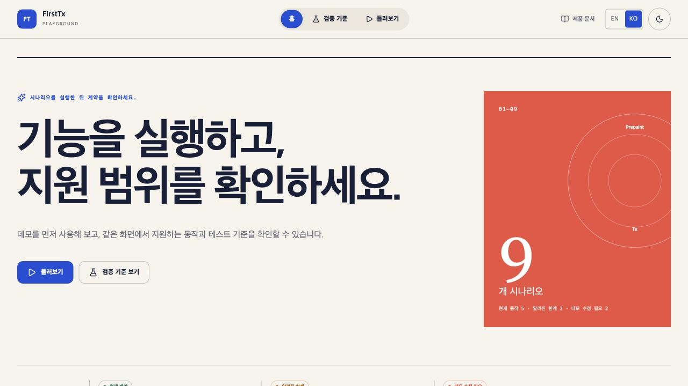
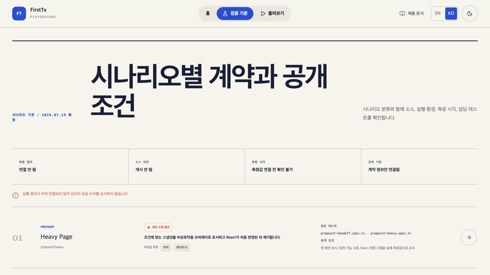

# FirstTx Playground

FirstTx Playground는 두 가지 용도로 운영합니다.

- OSS 사용자는 Prepaint, Local-First, Tx의 현재 동작과 알려진 한계를 직접 실행해 볼 수 있습니다.
- 저장소 개발자는 workspace 패키지 변경이 실제 앱에 반영됐는지 시나리오와 담당 테스트를 통해 확인할 수 있습니다.

홈은 시나리오 탐색을, `/lab`은 시나리오별 계약·분류·담당 테스트·공개 조건 확인을 담당합니다. 측정 결과가 연결되지 않은 상태에서는 임의의 성공 수치를 표시하지 않습니다.

## 화면

<table>
<tr>
<td align="center">시나리오 목록</td>
<td align="center">검증 기준</td>
</tr>
<tr>
<td></td>
<td></td>
</tr>
</table>

## 시나리오

2026년 7월 19일 기준으로 아홉 개 시나리오를 제공합니다.

| 패키지                 | 시나리오                    | 분류           | 확인 내용                          |
| ---------------------- | --------------------------- | -------------- | ---------------------------------- |
| Prepaint               | Heavy Page                  | 데모 수정 필요 | 저장된 화면과 React 전환 순서      |
| Prepaint + Local-First | Route Switching             | 현재 계약      | 경로별 스냅샷과 허용 목록          |
| Local-First + Tx       | Optimistic Cart             | 데모 수정 필요 | 낙관적 화면 반영과 서버 응답 분리  |
| Local-First + Tx       | Replace / Rollback Ordering | 알려진 한계    | 데이터 교체와 롤백의 처리 순서     |
| Local-First            | Staleness Detection         | 현재 계약      | TTL과 화면 진입 시 동기화 전략     |
| Local-First            | Suspense Cache Flow         | 현재 계약      | 첫 방문·유효 캐시·만료 캐시 흐름   |
| Tx + Local-First       | Overlapping Hook Calls      | 알려진 한계    | 겹치는 호출에서 공유되는 훅 상태   |
| Tx                     | Rollback Chain              | 현재 계약      | 완료된 단계의 역순 보상 처리       |
| Tx                     | Retry and Backoff           | 현재 계약      | 재시도 횟수·대기 방식·소진 뒤 롤백 |

시나리오 분류와 공개 계약의 기준 문서는 [`docs/playground-contract.md`](../../docs/playground-contract.md)입니다.

## 측정값 분류

- `contract`: 현재 패키지가 보장하는 결정적 동작입니다. 관련 검사가 실패하면 릴리스를 막습니다.
- `benchmark`: 브라우저·기기·네트워크에 따라 달라지는 관찰값입니다. 고정된 성공 보장으로 사용하지 않습니다.
- `expected-limitation`: 현재 지원하지 않는 동작입니다. 한계를 정확히 재현하고 설명하는 것이 검증 조건입니다.

## 실행

저장소 루트에서 실행합니다. 이 저장소는 Node.js 24와 pnpm을 사용합니다.

```bash
pnpm install
pnpm dev
```

루트 `pnpm dev`는 Playground와 workspace 패키지 watcher를 함께 실행합니다. Playground 화면만 확인할 때는 다음 명령을 사용할 수 있지만, 패키지 `src` 변경을 바로 반영하려면 필요한 패키지 watcher를 별도로 실행해야 합니다.

```bash
pnpm --filter playground dev
```

## 검증

```bash
pnpm --filter playground lint
pnpm --filter playground typecheck
pnpm --filter playground test:contract
pnpm --filter playground build
pnpm --filter playground test:e2e --workers=2
```

Playwright 테스트가 생성하는 측정 결과는 `.metrics/`에 저장됩니다. `sync-staleness`는 schema v1 artifact와 provenance를 생성하며 `metrics:sync`가 immutable run과 manifest를 만듭니다. 실패 run도 현재 상태로 게시하되 workflow는 실패를 유지하고 이전 성공 run ID를 별도로 보존합니다. GitHub Pages의 `https://joseph0926.github.io/firsttx/`가 canonical metric host이고 `/lab`은 source revision, freshness와 current/last-success 상태를 읽습니다. 나머지 시나리오는 schema 전환 전까지 `not-measured` 또는 legacy로 유지합니다.

## 주요 경로

```text
apps/playground/
├── src/
│   ├── components/
│   │   ├── demo/               # 시나리오 공통 프레임
│   │   └── playground/         # 홈·검증 화면 공통 UI
│   ├── data/
│   │   ├── learning-paths.ts   # 데모 설명과 관련 시나리오
│   │   └── playground-contract.ts
│   ├── pages/
│   │   ├── prepaint/
│   │   ├── sync/
│   │   ├── tx/
│   │   ├── home.page.tsx
│   │   └── verification-lab.page.tsx
│   └── router.tsx
└── tests/
```

## 관련 문서

- [Playground 계약과 측정값 분류](../../docs/playground-contract.md)
- [Playground UI/UX 결정 기록](../../docs/uiux/playground-redesign.md)
- [전체 업데이트 계획](../../docs/update-plan.md)
- [FirstTx API](https://firsttx.store/ko/docs/reference)

## 라이선스

MIT
