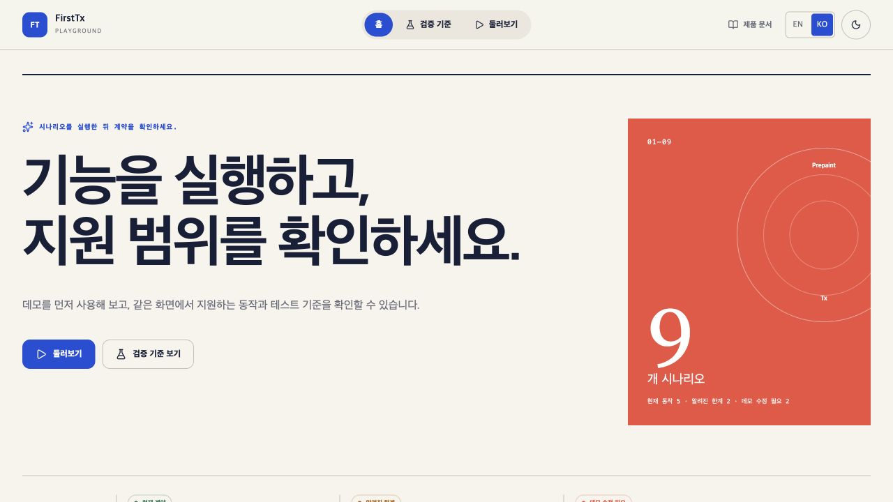
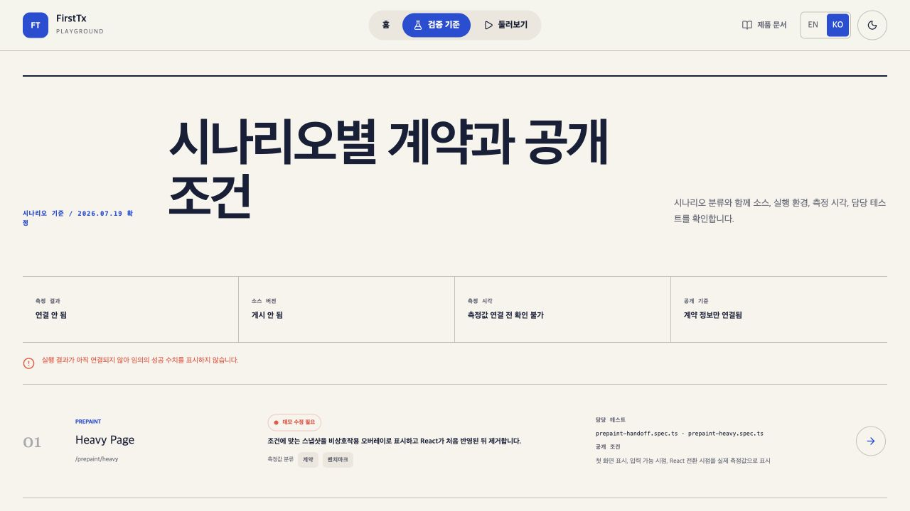

# FirstTx Playground

FirstTx Playground는 두 가지 용도로 운영합니다.

- OSS 사용자는 Prepaint, Local-First, Tx의 현재 동작과 알려진 한계를 직접 실행해 볼 수 있습니다.
- 저장소 개발자는 workspace 패키지 변경이 실제 앱에 반영됐는지 시나리오와 담당 테스트를 통해 확인할 수 있습니다.

홈은 시나리오 탐색을, `/lab`은 시나리오별 계약·분류·담당 테스트·공개 조건 확인을 담당합니다. 측정 결과가 연결되지 않은 상태에서는 임의의 성공 수치를 표시하지 않습니다.

시나리오 분류, 공개 조건과 metric rollout의 현재 상태는 [Playground 계약](../../docs/playground-contract.md)이 소유합니다.

## 화면

<table>
<tr>
<td align="center">시나리오 목록</td>
<td align="center">검증 기준</td>
</tr>
<tr>
<td></td>
<td></td>
</tr>
</table>

## 측정값 분류

- `contract`: 현재 패키지가 보장하는 결정적 동작입니다. 관련 검사가 실패하면 릴리스를 막습니다.
- `benchmark`: 브라우저·기기·네트워크에 따라 달라지는 관찰값입니다. 고정된 성공 보장으로 사용하지 않습니다.
- `expected-limitation`: 현재 지원하지 않는 동작입니다. 한계를 정확히 재현하고 설명하는 것이 검증 조건입니다.

## 실행

저장소 루트에서 실행합니다. 이 저장소는 Node.js 24와 pnpm을 사용합니다.

```bash
pnpm install
pnpm dev
```

루트 `pnpm dev`는 Playground와 workspace 패키지 watcher를 함께 실행합니다. Playground 화면만 확인할 때는 다음 명령을 사용할 수 있지만, 패키지 `src` 변경을 바로 반영하려면 필요한 패키지 watcher를 별도로 실행해야 합니다.

```bash
pnpm --filter playground dev
```

## 검증

```bash
pnpm --filter playground lint
pnpm --filter playground typecheck
pnpm --filter playground test:contract
pnpm --filter playground build
pnpm --filter playground test:e2e --workers=2
```

Playwright 테스트가 생성하는 측정 결과는 `.metrics/`에 저장됩니다. `metrics:sync`는 검증된 artifact를 immutable run과 manifest로 게시합니다. 실패 run도 현재 상태로 게시하되 workflow는 실패를 유지하고 이전 성공 run ID를 별도로 보존합니다.

## 관련 문서

- [Playground 계약과 측정값 분류](../../docs/playground-contract.md)
- [FirstTx API](https://firsttx.store/ko/docs/reference)

## 라이선스

MIT
